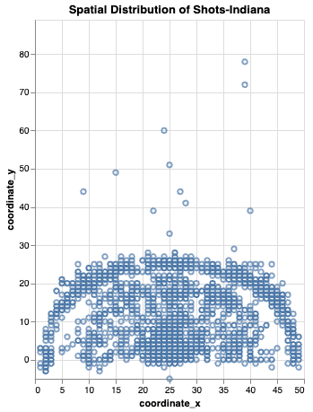

# WNBA 2021 Shot Analysis

## Project Description

This project focuses on the analysis of shooting performance in the WNBA during the 2021 season. Through a series of visualizations, we explored the shot statistics of teams and players, providing valuable insights for fans and analysts.

## Visualization Content

The created visualizations include:

1. **Histograms of Shots Taken**:
   - These charts display the total distribution of shots taken by teams, providing an overview of general trends and performance throughout the season.
     
   
   

2. **Spatial Distribution of Shots**:
   - Using a heatmap, this visualization represents the shooting hotspots, highlighting the areas of the court from which players tend to score the most. This helps to understand the offensive strategies utilized by teams.
   
   
   

3. **Bar Chart of Made and Missed Shots by Quarter**:
   - This visualization allows for the analysis of shooting effectiveness broken down by each quarter of play. By showing the percentage of successful and missed shots, it provides a clear picture of how shooting performance may vary throughout a game.
   
   
   
